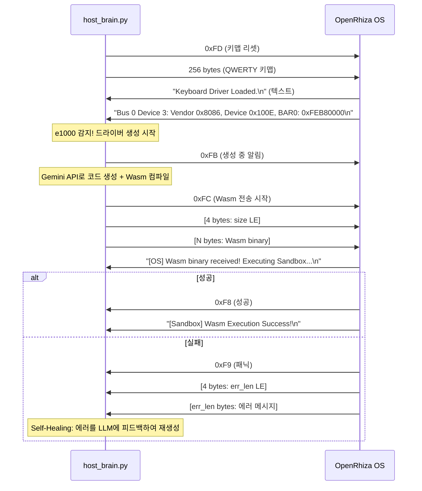

# OpenRhiza Serial Communication Protocol
# OS ↔ 호스트 시리얼 통신 프로토콜 정의 (개발/테스트 전용)

> **⚠️ 시리얼 통신은 QEMU 테스트 환경에서만 사용됩니다.**
> 프로덕션에서는 OS가 키보드+모니터+LAN을 자체적으로 구동하며, LAN을 통해 직접 LLM API에 접속합니다.
>
> **이 프로토콜 바이트를 변경하면 OS와 호스트 스크립트 간 호환성이 즉시 깨집니다.**
> 새 프로토콜 바이트를 추가할 때는 이 문서를 먼저 갱신하세요.

---

## 통신 채널

```
OpenRhiza OS (QEMU 게스트)                 host_brain.py (호스트)
        │                                         │
        │   COM1 (0x3F8) ← UART 16550 →          │
        │   TCP 127.0.0.1:4444                    │
        └─────────────── 양방향 ──────────────────┘
```

- **물리 계층:** QEMU가 에뮬레이션하는 16550 UART 시리얼 포트
- **전송 계층:** TCP 소켓 (QEMU `-serial tcp:` 옵션)
- **데이터 형식:** 원시 바이트 스트림 (프레이밍 없음)
- **텍스트 출력:** OS의 `println!` / `serial_println!` 매크로 → UTF-8 + `\n`

---

## 프로토콜 바이트 정의

### 호스트 → OS 방향 (Host-to-OS)

| 바이트 | 이름 | 방향 | 의미 |
|--------|------|------|------|
| `0xFD` | `KEYMAP_RESET` | Host→OS | 키맵 수신 버퍼 초기화. 이 바이트 이후 256바이트가 키맵 데이터 |
| `0xFE` | `CALIBRATION_FAIL` | Host→OS | 캘리브레이션 실패. OS가 사용자에게 재입력 요청 |
| `0xFB` | `DRIVER_GENERATING` | Host→OS | "AI가 드라이버를 생성 중" 알림 |
| `0xFA` | `DRIVER_GEN_FAILED` | Host→OS | 드라이버 생성 최종 실패 |
| `0xFC` | `WASM_TRANSFER_START` | Host→OS | Wasm 바이너리 전송 시작 신호 |
| `0x00`~`0xFF` | (키맵 데이터) | Host→OS | 0xFD 이후 순차적 256바이트 키맵 |

### Wasm 바이너리 전송 시퀀스 (Host→OS)
```
[0xFC] [size_byte_0] [size_byte_1] [size_byte_2] [size_byte_3] [wasm_byte_0] [wasm_byte_1] ... [wasm_byte_N-1]
       ├──── u32 little-endian (N) ────┤          ├────────── N바이트 Wasm ─────────────────┤
```
- 각 바이트 사이 최소 2ms 딜레이 (시리얼 오버런 방지)

### OS → 호스트 방향 (OS-to-Host)

| 바이트 | 이름 | 방향 | 의미 |
|--------|------|------|------|
| `0xF8` | `WASM_EXEC_SUCCESS` | OS→Host | Wasm 샌드박스 실행 성공 |
| `0xF9` | `WASM_EXEC_PANIC` | OS→Host | Wasm 샌드박스 실행 실패 (에러 메시지 뒤따름) |

### Wasm 에러 전송 시퀀스 (OS→Host)
```
[0xF9] [err_len_byte_0..3] [err_string_bytes...]
       ├── u32 LE (문자열 길이) ──┤ ├── UTF-8 에러 메시지 ──┤
```

### 텍스트 로그 (OS→Host)
- `println!` / `serial_println!` 출력은 UTF-8 문자열 + `\n`
- 호스트에서 줄 단위(`\n` 분리)로 파싱

---

## 바이트 할당 맵 (예약 현황)

```
0x00 ~ 0xEF : 미할당 (일반 데이터 용도)
0xF0 ~ 0xF7 : 미할당 (향후 확장용)
0xF8        : WASM_EXEC_SUCCESS      (OS→Host)
0xF9        : WASM_EXEC_PANIC        (OS→Host)
0xFA        : DRIVER_GEN_FAILED      (Host→OS)
0xFB        : DRIVER_GENERATING      (Host→OS)
0xFC        : WASM_TRANSFER_START    (Host→OS)
0xFD        : KEYMAP_RESET           (Host→OS)
0xFE        : CALIBRATION_FAIL       (Host→OS)
0xFF        : 미할당 (예약)
```

---

## 데이터 흐름 다이어그램



---

## 향후 확장 계획

| 바이트 | 용도 (예정) | 상태 |
|--------|-------------|------|
| `0xF0` | 타이머 동기화 핸드셰이크 | 미정 |
| `0xF1` | 힙 상태 리포트 요청 | 미정 |
| `0xF2` | DMA 상태 리포트 요청 | 미정 |
| `0xF3`~`0xF7` | 추가 드라이버 타입 구분 | 미정 |
