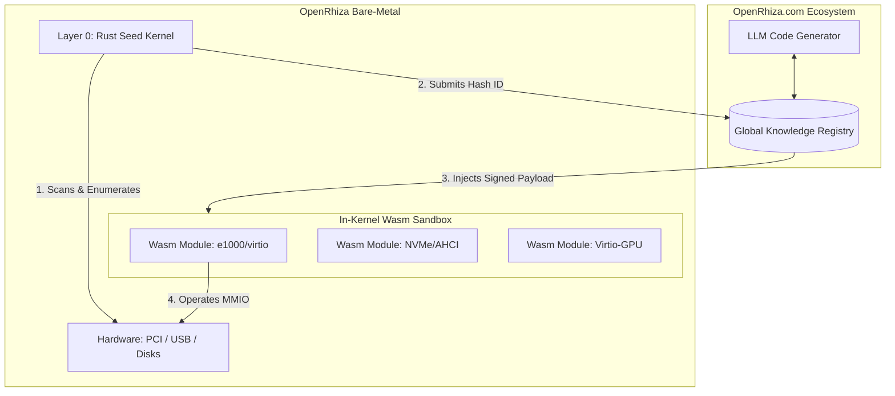

<div align="center">

```text
  █████   ██████   ███████  ███    ██  ██████   ██   ██  ██  ███████    █████   
 ██▒▒▒██  ██▒▒▒██▒ ██▒▒▒▒▒▒ ████   ██▒ ██▒▒▒██▒ ██▒  ██▒ ██▒  ▒▒▒██▒▒  ██▒▒▒██  
 ██▒  ██▒ ██████▒▒ █████▒   ██▒██  ██▒ ██████▒▒ ███████▒ ██▒    ██▒▒   ███████▒ 
 ██▒  ██▒ ██▒▒▒▒▒  ██▒▒▒▒▒  ██▒ ██ ██▒ ██▒▒▒██▒ ██▒▒▒██▒ ██▒   ██▒▒    ██▒▒▒██▒ 
  █████▒▒ ██▒      ███████▒ ██▒  ████▒ ██▒  ██▒ ██▒  ██▒ ██▒ ███████   ██▒  ██▒ 
   ▒▒▒▒▒   ▒▒       ▒▒▒▒▒▒▒  ▒▒   ▒▒▒▒  ▒▒   ▒▒  ▒▒   ▒▒  ▒▒  ▒▒▒▒▒▒▒   ▒▒   ▒▒ 
      🌱
 ━━━━━━━━━━━━━━━━━━━━━━━━━━━━━━━━━━━━━━━━━━━
      /   /   /   │   \   \   \
      .─╯ .─╯ .─╯   │   ╰─. ╰─. ╰─.
      /  .─╯ .─╯   .─┴─.   ╰─. ╰─.  \
      .─╯ /   /     /     \     \   \ ╰─.
      /   /   /     /       \     \   \   \
      .   .   .     .         .     .   .   .
```

### The AI-Native Operating System

**OpenRhiza is a sandbox-first AI operating system.**
It keeps only the minimum survival path in the core, and moves drivers, skills, workflows, display expansion, and GUI behavior into isolated Wasm-owned capabilities whenever possible.
Starting from an ultra-light bare-metal root (*Rhiza*), it grows the machine by querying OpenRhiza.com, reusing known-good artifacts, generating missing parts with LLMs, validating them in sandbox form, and only then promoting them.

[](#releases)
[](#)
[](#)
[](#)

*Tags: `#operating-system` `#llm` `#ai` `#wasm` `#x86_64` `#rust` `#bare-metal`*

---

</div>

## 📖 The "Rhiza" Philosophy

Like a robust underground root system (Rhizome), OpenRhiza is built on an indestructible, tiny base layer (`Layer 0 / Seed`). That base should remain small enough to survive failure and recover input, display, storage bootstrap, and networking. Everything else should be grown as isolated capability objects delivered through `skills`, `workflows`, `drivers`, and `programs`.

### Key Innovations

1. **Core Minimalism**: Keep only the mandatory survival path in the core. Do not let the kernel become the home of higher-level policy or feature code.
2. **Sandbox-First Capabilities**: Drivers, skills, workflows, display sessions, and GUI behavior should be isolated runtime objects first.
3. **Object Discipline**: GUI items, drivers, skills, and services should have explicit identity, state, bounds, lifecycle, and rollback boundaries so one broken object does not silently corrupt another.
4. **Prompt-First Operation**: Users should declare intent. OpenRhiza should query, reuse, generate, validate, activate, and report without turning the user into a manual package manager.
5. **No Traditional App Store**: OpenRhiza.com is a capability registry, not a static app catalog.

## 🌐 The Nexus: OpenRhiza.com Ecosystem

The true power of this OS lies not within the local machine, but in its connection to its global cloud counterpart, **OpenRhiza.com**. 

Instead of shipping with gigabytes of legacy hardware drivers, the kernel fetches strictly what it needs from the cloud at runtime. If an unknown PCI or USB device is detected, the kernel queries the Nexus. If no driver exists, the LLM generates a brand new driver compiled into Wasm on the spot and beams it down to the OS. 

**Maturity by Consensus (Voting System)**
The overall quality and readiness of a driver isn't determined manually—it is evaluated through a continuous **dual-voting mechanism** between the OS nodes and the LLM:
- **OS Telemetry Vote (Execution)**: Real-world OS instances globally test the Wasm payload. If a driver crashes the sandbox, drops packets, or triggers deadlocks, the OS casts an automatic negative vote. 
- **LLM Analytic Vote (Validation)**: The LLM processes these crash reports, refines the logic, and casts a positive vote once the revised code passes simulated CI tests.

Through this constant feedback loop and voting, OpenRhiza automatically weeds out unstable logic. Only the highest-scored, battle-tested Wasm modules solidify in the global public registry, guaranteeing a self-healing and ever-improving hardware compatibility network.

## 🏗️ Architecture



## 🚀 Current Status

OpenRhiza is in a **sandbox-owned bootstrap GUI phase**.

What works now:

- `x86_64` bare-metal boot, IDT, LAPIC, async task runtime, and recovery console
- Wasm sandbox execution inside the kernel
- OpenRhiza.com capability lookup and download path
- local driver and skill cache seeds on the QEMU driver disk
- staged display bring-up: recovery console -> framebuffer validation -> GUI bootstrap
- a `1920x1080` bootstrap GUI with object-based sidebar, conversation surface, and composer
- object-scoped GUI mutation path exposed to sandbox skills and LLM machine actions
- live GUI input path and recovery rollback path coexisting again after deadlock fixes

What is still in progress:

- final compositor seed stabilization
- complete elimination of residual GUI redraw flicker
- richer per-object scrolling, editing, and selection
- stronger self-hosted GUI development from inside the OpenRhiza console
- tighter separation between temporary bootstrap presenters and long-term sandbox-owned GUI/runtime behavior

## 📥 Getting Started

You need Rust `nightly`, `cargo-bootimage`, and QEMU (or VMware) to experience the root system.

```bash
# Clone the repository
git clone https://github.com/eljja/OpenRhiza.git
cd OpenRhiza

# Build and boot the raw OS image
cargo bootimage
cargo run
```

## 📦 Releases

We track our stable evolutionary steps via [GitHub Releases](https://github.com/eljja/OpenRhiza/releases).

- **v0.0.1 - The Sandbox Protocol**: Introduced the first in-kernel Wasm host.
- **v0.0.2 - Network Awakening**: e1000 routing & smoltcp bindings.
- **v0.0.3 (WIP)** - Microkernel Migration & Cloud Payload Fetch.

## 🤝 Community & Documentation

Explore the depths of the root system through our engineering documents:
- [VISION.md](VISION.md): The ultimate grand goal.
- [ARCHITECTURE.md](ARCHITECTURE.md): The 5-layer system.
- [DISPLAY_ABI.md](DISPLAY_ABI.md): The display handoff boundary between core and sandbox skills.
- [GUI_DEVELOPMENT.md](GUI_DEVELOPMENT.md): The dual-track GUI plan for native object GUI and LVGL-style bridging.
- [OS.md](OS.md): The baseline operating rules that the internal OpenRhiza intelligence should follow.
- [CAPABILITY_REGISTRY.md](CAPABILITY_REGISTRY.md): Why OpenRhiza.com is a capability registry rather than an app store.
- [KNOWN_ISSUES.md](KNOWN_ISSUES.md): Active technical limits and unresolved runtime issues.
- [Gemini_walkthrough.md](Gemini_walkthrough.md): The Wasm migration realism logs.
- [Gemini.md](Gemini.md): Short-form running logs.

*(Seeking contributors who love bare-metal OS, x86_64 architectures, WebAssembly runtimes, and Large Language Models. Join us in building the next generation!)*
