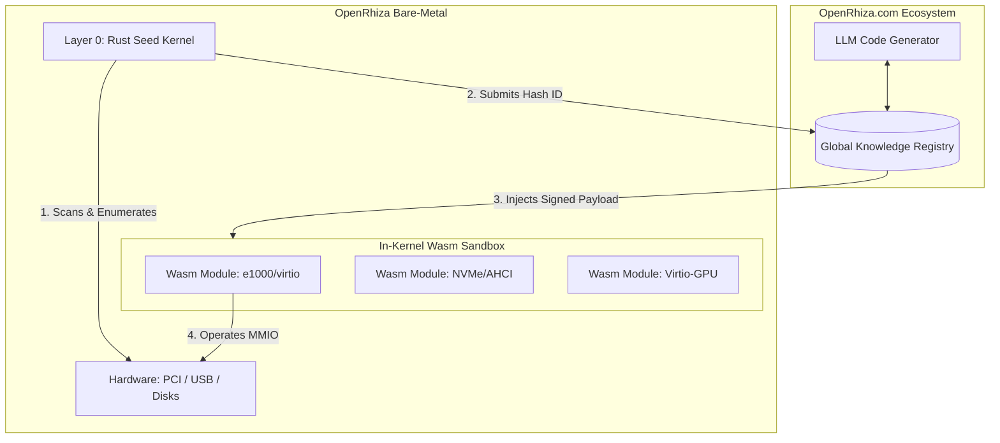

<div align="center">

```text
  █████   ██████   ███████  ███    ██  ██████   ██   ██  ██  ███████    █████   
 ██▒▒▒██  ██▒▒▒██▒ ██▒▒▒▒▒▒ ████   ██▒ ██▒▒▒██▒ ██▒  ██▒ ██▒  ▒▒▒██▒▒  ██▒▒▒██  
 ██▒  ██▒ ██████▒▒ █████▒   ██▒██  ██▒ ██████▒▒ ███████▒ ██▒    ██▒▒   ███████▒ 
 ██▒  ██▒ ██▒▒▒▒▒  ██▒▒▒▒▒  ██▒ ██ ██▒ ██▒▒▒██▒ ██▒▒▒██▒ ██▒   ██▒▒    ██▒▒▒██▒ 
  █████▒▒ ██▒      ███████▒ ██▒  ████▒ ██▒  ██▒ ██▒  ██▒ ██▒ ███████   ██▒  ██▒ 
   ▒▒▒▒▒   ▒▒       ▒▒▒▒▒▒▒  ▒▒   ▒▒▒▒  ▒▒   ▒▒  ▒▒   ▒▒  ▒▒  ▒▒▒▒▒▒▒   ▒▒   ▒▒ 
      🌱
 ━━━━━━━━━━━━━━━━━━━━━━━━━━━━━━━━━━━━━━━━━━━
      /   /   /   │   \   \   \
      .─╯ .─╯ .─╯   │   ╰─. ╰─. ╰─.
      /  .─╯ .─╯   .─┴─.   ╰─. ╰─.  \
      .─╯ /   /     /     \     \   \ ╰─.
      /   /   /     /       \     \   \   \
      .   .   .     .         .     .   .   .
```

### The AI-Native Operating System

**OpenRhiza is a self-evolving operating system where LLMs generate hardware drivers into isolated Wasm sandboxes in real-time.** 
Starting from an ultra-lightweight bare-metal root (*Rhiza*), it continuously bridges the gap between hardware and software by hot-swapping AI-generated capabilities. 
It aims for 100% crash-proof learning environments and native-level execution performance for limitless branching.

[](#releases)
[](#)
[](#)
[](#)

*Tags: `#operating-system` `#llm` `#ai` `#wasm` `#x86_64` `#rust` `#bare-metal`*

---

</div>

## 📖 The "Rhiza" Philosophy

Like a robust underground root system (Rhizome), OpenRhiza is built on an indestructible, tiny base layer (`Layer 0 / Seed`). Currently, it may only show a small sprout above the surface (basic shell/networking), but its roots are vast—connected to a global P2P AI ecosystem (`openrhiza.com`) capable of flowering into any application, driver, or GPU stack on demand.

### Key Innovations

1. **AI as the Kernel**: The AI bounds the OS; it generates logic, runs it, and validates it.
2. **Real-time Wasm Drivers**: A True Microkernel where hardware drivers are compiled into WebAssembly globally, injected via the cloud, and safely sandboxed.
3. **Extreme Performance**: Once validated in the slow Wasm sandbox, logic can be compiled JIT into aggressive native code, yielding HPC-ready speeds without sacrificing safety.
4. **No "App Stores"**: There are no installed applications. You declare your intent, and the AI weaves the transient UI and logic required just for you.

## 🌐 The Nexus: OpenRhiza.com Ecosystem

The true power of this OS lies not within the local machine, but in its connection to its global cloud counterpart, **OpenRhiza.com**. 

Instead of shipping with gigabytes of legacy hardware drivers, the kernel fetches strictly what it needs from the cloud at runtime. If an unknown PCI or USB device is detected, the kernel queries the Nexus. If no driver exists, the LLM generates a brand new driver compiled into Wasm on the spot and beams it down to the OS. 

**Maturity by Consensus (Voting System)**
The overall quality and readiness of a driver isn't determined manually—it is evaluated through a continuous **dual-voting mechanism** between the OS nodes and the LLM:
- **OS Telemetry Vote (Execution)**: Real-world OS instances globally test the Wasm payload. If a driver crashes the sandbox, drops packets, or triggers deadlocks, the OS casts an automatic negative vote. 
- **LLM Analytic Vote (Validation)**: The LLM processes these crash reports, refines the logic, and casts a positive vote once the revised code passes simulated CI tests.

Through this constant feedback loop and voting, OpenRhiza automatically weeds out unstable logic. Only the highest-scored, battle-tested Wasm modules solidify in the global public registry, guaranteeing a self-healing and ever-improving hardware compatibility network.

## 🏗️ Architecture



## 🚀 Status & Roadmap

OpenRhiza is currently in the **Bootstrap Phase**. We are cementing the root system.

- **[DONE]** `x86_64` bare-metal boot, IDT, LAPIC, and async structures.
- **[DONE]** Native Wasm interpreter embedded in Kernel (True Sandbox).
- **[DONE]** Standalone network drivers dynamically loaded.
- **[WIP]** Multi-Wasm Capability: Enabling Storage, NIC, and GPU to execute asynchronously.
- **[WIP]** Native TLS 1.3 injection for secure Nexus fetching.
- **[FUTURE]** LLM orchestration directly over PCI/GPU instances.

## 📥 Getting Started

You need Rust `nightly`, `cargo-bootimage`, and QEMU (or VMware) to experience the root system.

```bash
# Clone the repository
git clone https://github.com/eljja/OpenRhiza.git
cd OpenRhiza

# Build and boot the raw OS image
cargo bootimage
cargo run
```

## 📦 Releases

We track our stable evolutionary steps via [GitHub Releases](https://github.com/eljja/OpenRhiza/releases).

- **v0.0.1 - The Sandbox Protocol**: Introduced the first in-kernel Wasm host.
- **v0.0.2 - Network Awakening**: e1000 routing & smoltcp bindings.
- **v0.0.3 (WIP)** - Microkernel Migration & Cloud Payload Fetch.

## 🤝 Community & Documentation

Explore the depths of the root system through our engineering documents:
- [VISION.md](VISION.md): The ultimate grand goal.
- [ARCHITECTURE.md](ARCHITECTURE.md): The 5-layer system.
- [Gemini_walkthrough.md](Gemini_walkthrough.md): The Wasm migration realism logs.
- [Gemini.md](Gemini.md): Short-form running logs.

*(Seeking contributors who love bare-metal OS, x86_64 architectures, WebAssembly runtimes, and Large Language Models. Join us in building the next generation!)*
